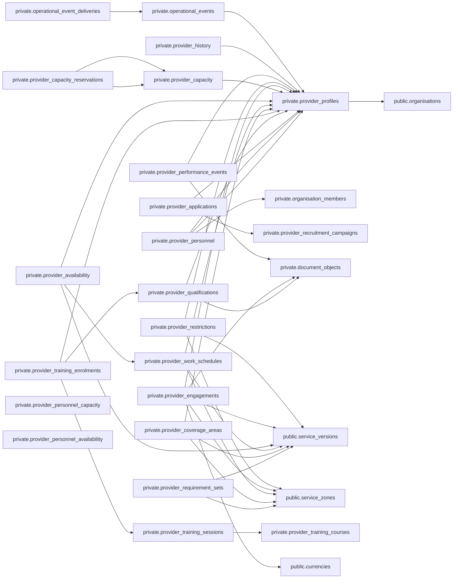

# Provider Network — physical FK graph

Local candidate. Actor/creator references are documented in the dictionary but omitted from this graph. No order/assignment table is claimed.

```mermaid
flowchart LR
    private_provider_profiles["private.provider_profiles"]
    private_provider_profiles --> public_organisations["public.organisations"]
    private_provider_personnel["private.provider_personnel"]
    private_provider_personnel --> private_organisation_members["private.organisation_members"]
    private_provider_personnel --> private_provider_profiles["private.provider_profiles"]
    private_provider_personnel --> private_provider_profiles["private.provider_profiles"]
    private_provider_recruitment_campaigns["private.provider_recruitment_campaigns"]
    private_provider_applications["private.provider_applications"]
    private_provider_applications --> private_provider_recruitment_campaigns["private.provider_recruitment_campaigns"]
    private_provider_applications --> private_provider_profiles["private.provider_profiles"]
    private_provider_qualifications["private.provider_qualifications"]
    private_provider_qualifications --> private_document_objects["private.document_objects"]
    private_provider_qualifications --> private_provider_profiles["private.provider_profiles"]
    private_provider_requirement_sets["private.provider_requirement_sets"]
    private_provider_requirement_sets --> public_service_versions["public.service_versions"]
    private_provider_requirement_sets --> public_service_zones["public.service_zones"]
    private_provider_training_courses["private.provider_training_courses"]
    private_provider_training_sessions["private.provider_training_sessions"]
    private_provider_training_sessions --> private_provider_training_courses["private.provider_training_courses"]
    private_provider_training_enrolments["private.provider_training_enrolments"]
    private_provider_training_enrolments --> private_provider_profiles["private.provider_profiles"]
    private_provider_training_enrolments --> private_provider_qualifications["private.provider_qualifications"]
    private_provider_training_enrolments --> private_provider_training_sessions["private.provider_training_sessions"]
    private_provider_coverage_areas["private.provider_coverage_areas"]
    private_provider_coverage_areas --> private_provider_profiles["private.provider_profiles"]
    private_provider_coverage_areas --> public_service_versions["public.service_versions"]
    private_provider_coverage_areas --> public_service_zones["public.service_zones"]
    private_provider_work_schedules["private.provider_work_schedules"]
    private_provider_work_schedules --> private_provider_profiles["private.provider_profiles"]
    private_provider_work_schedules --> public_service_versions["public.service_versions"]
    private_provider_work_schedules --> public_service_zones["public.service_zones"]
    private_provider_availability["private.provider_availability"]
    private_provider_availability --> private_provider_profiles["private.provider_profiles"]
    private_provider_availability --> private_provider_work_schedules["private.provider_work_schedules"]
    private_provider_availability --> public_service_versions["public.service_versions"]
    private_provider_capacity["private.provider_capacity"]
    private_provider_capacity --> private_provider_profiles["private.provider_profiles"]
    private_provider_capacity_reservations["private.provider_capacity_reservations"]
    private_provider_capacity_reservations --> private_provider_capacity["private.provider_capacity"]
    private_provider_capacity_reservations --> private_provider_capacity["private.provider_capacity"]
    private_provider_engagements["private.provider_engagements"]
    private_provider_engagements --> public_currencies["public.currencies"]
    private_provider_engagements --> private_document_objects["private.document_objects"]
    private_provider_engagements --> private_provider_profiles["private.provider_profiles"]
    private_provider_engagements --> public_service_versions["public.service_versions"]
    private_provider_engagements --> public_service_zones["public.service_zones"]
    private_provider_restrictions["private.provider_restrictions"]
    private_provider_restrictions --> private_provider_profiles["private.provider_profiles"]
    private_provider_restrictions --> public_service_versions["public.service_versions"]
    private_provider_restrictions --> public_service_zones["public.service_zones"]
    private_provider_performance_events["private.provider_performance_events"]
    private_provider_performance_events --> private_document_objects["private.document_objects"]
    private_provider_performance_events --> private_provider_profiles["private.provider_profiles"]
    private_provider_history["private.provider_history"]
    private_provider_history --> private_provider_profiles["private.provider_profiles"]
    private_operational_events["private.operational_events"]
    private_operational_events --> private_provider_profiles["private.provider_profiles"]
    private_operational_event_deliveries["private.operational_event_deliveries"]
    private_operational_event_deliveries --> private_operational_events["private.operational_events"]
    private_provider_personnel_capacity["private.provider_personnel_capacity"]
    private_provider_personnel_availability["private.provider_personnel_availability"]
```
